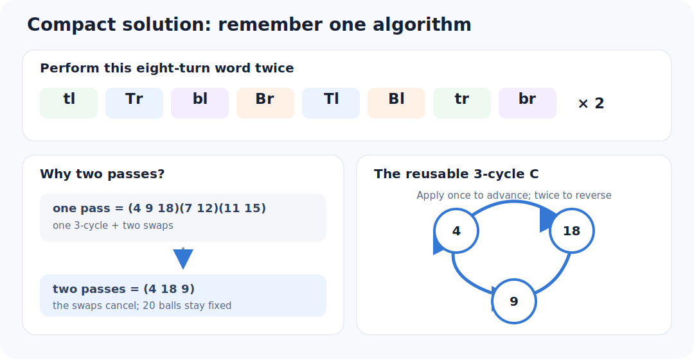
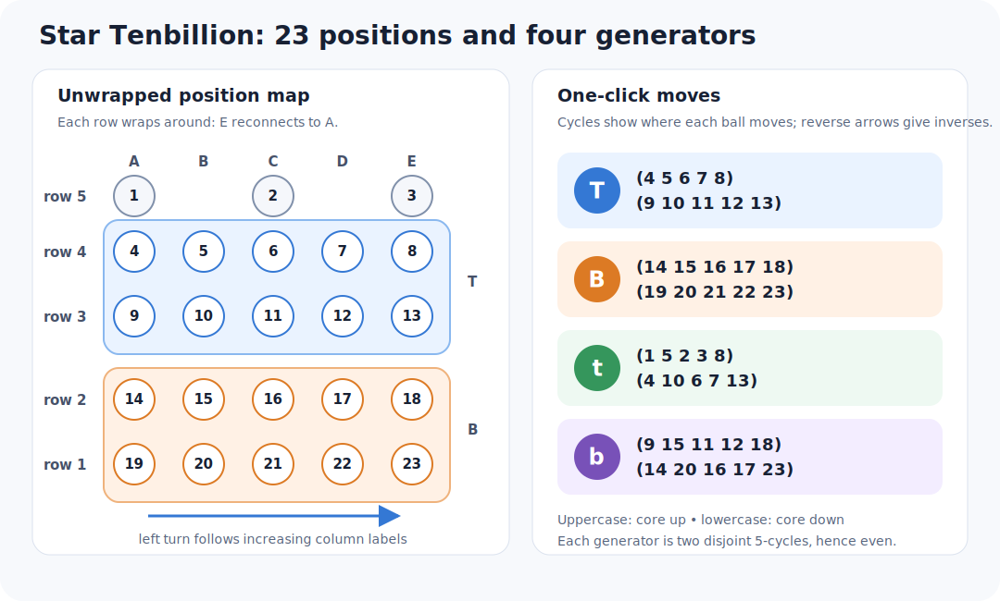

# A compact Star Tenbillion solution

The Pedro Luis solution uses three reusable algorithms. A method attributed to
Naoaki Takashima showed that one three-cycle is enough. An exhaustive GAP
search finds a shorter three-cycle with a simple mirrored pattern.

## One algorithm

`T` means the top disc with the core up; `b` means the bottom disc with the
core pushed down. The suffix `l` or `r` means one fifth-turn left or right.
A doubled suffix such as `ll` or `rr` means two consecutive clicks. Moving the
core between uppercase and lowercase moves is implicit.

In this notation, use

```text
C = Tl bll Tl | br Trr br
```

The bar separates two mirrored halves. Remember it as:

```text
top-bottom-top,    left  1-2-1
bottom-top-bottom, right 1-2-1
```



Only the normal-core top disc (`T`) and lowered-core bottom disc (`b`) occur.
GAP calculates

```text
C = T b^2 T b^-1 T^-2 b^-1 = (11,13,18).
```

The result moves exactly three balls and fixes the other 20. Applying `C`
twice reverses the cycle, so no inverse algorithm needs to be memorized.

Run the exact check with:

```sh
pixi run compact
pixi run search-compact
pixi run test
```

## Compactness result

The search treats any nonzero turn of one disc in one core position as one
face-turn-metric (FTM) move. Thus `l`, `ll`, `rr`, and `r` each cost one move.
It enumerates all reduced words over the 16 possible moves and finds no pure
3-cycle through depth 5; `C` is the first result at depth 6. Consequently six
FTM moves is optimal for a pure 3-cycle in this generator set.

In the fifth-turn metric, `C` costs eight clicks because each double turn costs
two. A second exhaustive pass finds no pure 3-cycle through depth 7, so eight
clicks is optimal too. This local result does not imply that using a shortest
3-cycle minimizes an entire solve.

## Position and color convention

Hold the puzzle with the core up. Looking down from above, name the columns
`A B C D E` in the direction of a left disc turn; `C` is the front column.
Rows are numbered from the bottom:

```text
          A     B     C     D     E
row 5    A5          C5          E5       three cap positions
row 4    A4    B4    C4    D4    E4
row 3    A3    B3    C3    D3    E3
row 2    A2    B2    C2    D2    E2
row 1    A1    B1    C1    D1    E1       bottom row
```



The solved cap contains the three balls of the color that occurs only three
times. Each other color occurs four times and fills rows 1–4 of one column.
The five column colors are interchangeable, so the bottom row can define the
answer. For example, if it reads

```text
A1=red  B1=blue  C1=green  D1=yellow  E1=orange,
```

then the target is red in `A2 A3 A4`, blue in `B2 B3 B4`, and so on. There is
no need to reproduce a factory color order.

First put the three odd-color balls in the cap and arrange row 1 to contain one
ball of each remaining color. This is the preliminary, intuitive part of the
Takashima method. Merely rotating the lower disc cannot change which colors
are in row 1; use ordinary disc/core moves until the five colors are present,
then choose their circular order. From this point onward, the cycles below
leave the cap and row 1 fixed after every setup is undone.

## Turn `C` into an insertion tool

The numbered cycle `(11,13,18)` is

```text
C = (C3 E3 E2).
```

For column building, use its conjugate

```text
K = tr C tl
  = tr (Tl bll Tl br Trr br) tl
  = (A4 E2 C3).
```

The initial `tr` and final `tl` are setup and undo moves, not a second
algorithm to memorize. One application of `K` moves the contents as follows:

| From | To |
|---|---|
| `A4` | `E2` |
| `E2` | `C3` |
| `C3` | `A4` |

`K` therefore inserts a ball from `A4` into `E2`. Applying `K` twice inserts
a ball from `C3` into `E2`. All other positions are fixed.

In general, if setup turns `S` carry a destination and donor to these working
positions, perform `S K S^-1` or `S K^2 S^-1`. Since words are executed from
left to right, undo the last setup turn first and reverse every direction.

## Align row 2, one column at a time

To fill a wrong position `X2`, where `X` is any column:

1. Read the required color from the anchor directly below it at `X1`.
2. Rotate the lower disc so that the destination `X2` is carried to the work
   position `E2`. Record this lower setup turn.
3. Find a ball of the required color in row 4 or row 3. Rotate the upper disc
   to carry a row-4 ball to `A4`, or a row-3 ball to `C3`. Record this upper
   setup turn.
4. Use `K` once for a ball at `A4`, or twice for a ball at `C3`.
5. Undo the upper setup, then undo the lower setup. The required ball is now at
   the original destination `X2`; previously completed row-2 positions have
   not moved.

If every available ball of the required color is already in row 2, first use
the cycle as a lift: carry one of those balls to `E2`, apply `K` once to move it
to `C3`, and undo the lower setup. Rows 3 and 4 are still unsolved, so their two
affected positions are safe buffers.

### Worked insertion

Suppose `B1` is blue, `B2` is wrong, and a blue ball is at `D4`.

- `Brr` carries the destination `B2` to `E2`.
- `Tll` carries the blue ball from `D4` to `A4`.
- `K` carries that blue ball from `A4` to `E2`.
- Undo with `Trr Bll`.

The complete operation is

```text
Brr Tll K Trr Bll
```

and finishes at the original orientation with blue at `B2`. Only the two
unsolved buffer balls that shared the 3-cycle moved elsewhere.

Repeat this insertion for `A2` through `E2`. It is usually efficient to leave
already-correct positions alone and choose donors from columns that are still
wrong.

## Complete rows 3 and 4 column-by-column

Once row 2 matches row 1, use one row-2 position as temporary storage. It may
be wrong during this phase; the other completed row-2 positions stay fixed.

1. Load the next required upper-row ball into the chosen row-2 buffer. To move
   a ball down, rotate it to `A4` and apply `K`, or rotate it to `C3` and apply
   `K` twice. Conjugate with lower-disc turns when the buffer is not `E2`.
2. To fill a row-4 destination, rotate that destination to `A4`, carry the
   buffered ball to `E2`, apply `K` twice, and undo both rotations. The buffer
   now contains the ball displaced from the other working position.
3. To fill a row-3 destination, rotate it to `C3`, carry the buffered ball to
   `E2`, apply `K` once, and undo both rotations.
4. Look at the color now in the buffer and take it to the row-3 or row-4 slot
   above the matching row-1 anchor. Continue following displaced colors. This
   is exactly following a cycle in a permutation: eventually the chain closes
   and the correct color returns to the row-2 buffer.
5. Start another chain if any upper position is still in the wrong column.

When only two colors appear wrong, do not try to swap just two balls: every
legal move is even. Include the row-2 buffer as the third position and use `K`
or `K` twice. Because balls of a color are indistinguishable, the final
same-color exchange absorbs the parity restriction.

At the end, every position above `A1` has color `A1`, every position above
`B1` has color `B1`, and so forth. Rotate both discs together only if you want
a particular color displayed at the front.

The setup choices depend on the scramble, so this is a repeatable insertion
method rather than one fixed solution string. Its advantage is that every
placement reduces to the same directed 3-cycle.

## GAP group-theoretic check

GAP also gives

```text
NormalClosure(A23, <C>) = A23.
```

Thus conjugates of this one 3-cycle generate the entire orientation-preserving
move group. This is the algebraic reason a single local cycle is sufficient as
the reusable operation. It does not mean that arbitrary conjugating setup
words are automatically short.

## Historical construction

Takashima's historical one-algorithm idea translates to

```text
(tl Tr bl Br Tl Bl tr br), repeated twice.
```

One pass is `(4,9,18)(7,12)(11,15)`: a 3-cycle and two swaps. Repeating it
cancels the swaps and leaves `(4,18,9)`. This costs 16 fifth-turn clicks, twice
the new word, but it motivates the same row-by-row method. The historical
description appears in the 1981 Cube Lovers archive; its orientation
conventions differ from this project.

The other documented macros cost 14, 14, and 44 fifth-turns and sometimes move
five or nine useful balls at once. Which method produces a shorter full solve
depends on the scramble.

The separate [optimal-number study](optimal-number.md) concerns provably
shortest solutions and currently establishes lower bounds, not a matching
God's number.

## Source

- [Stan Isaacs, “Ten Billion Puzzle (the Barrel),” Cube Lovers archive
  (1981)](https://www.math.rwth-aachen.de/~Martin.Schoenert/Cube-Lovers/Stan_Isaacs__Ten_Billion_Puzzle_%28the_Barrel%29.html)
