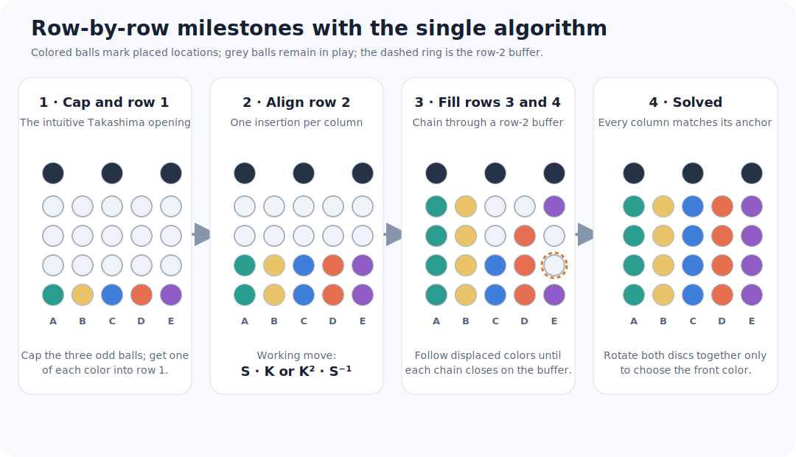
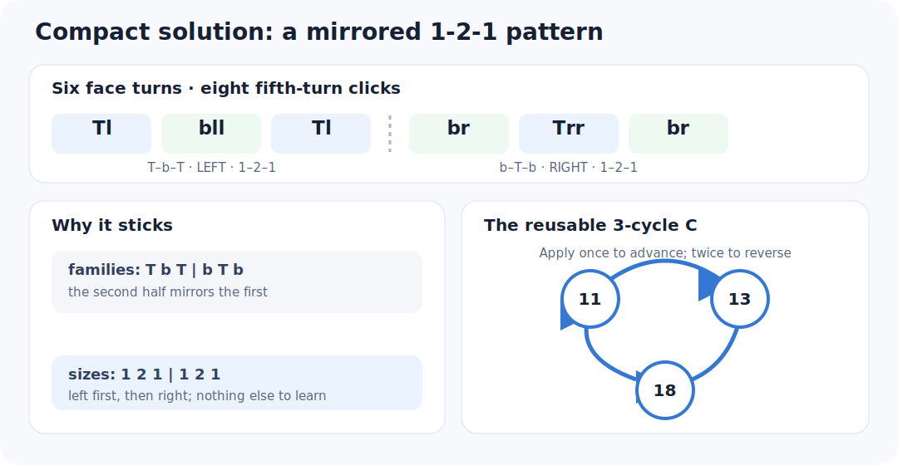
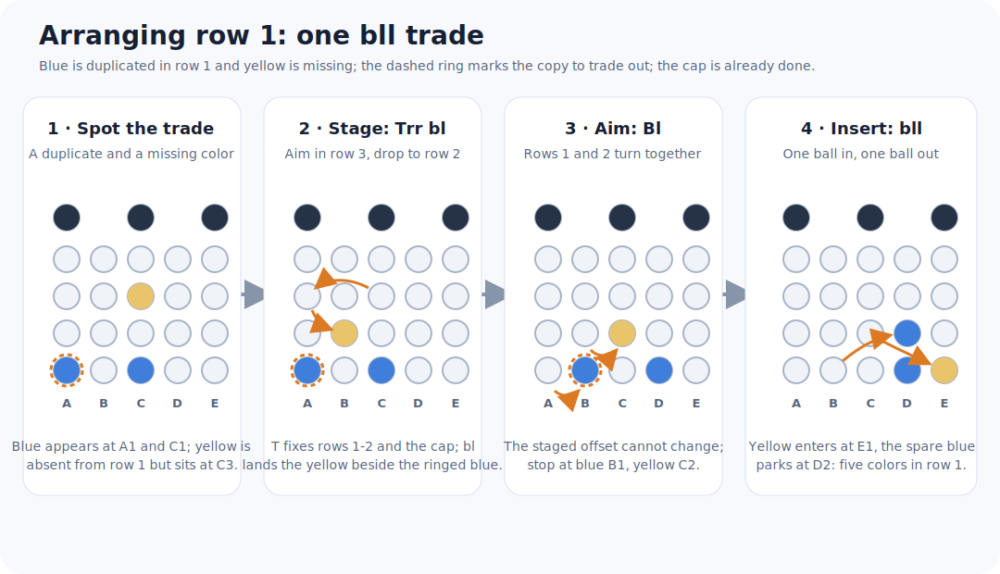
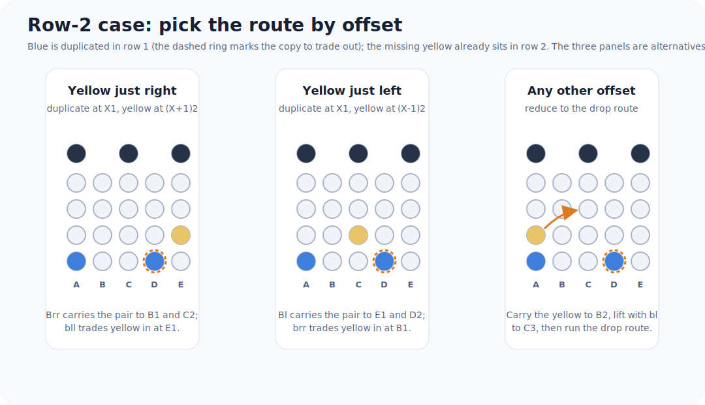
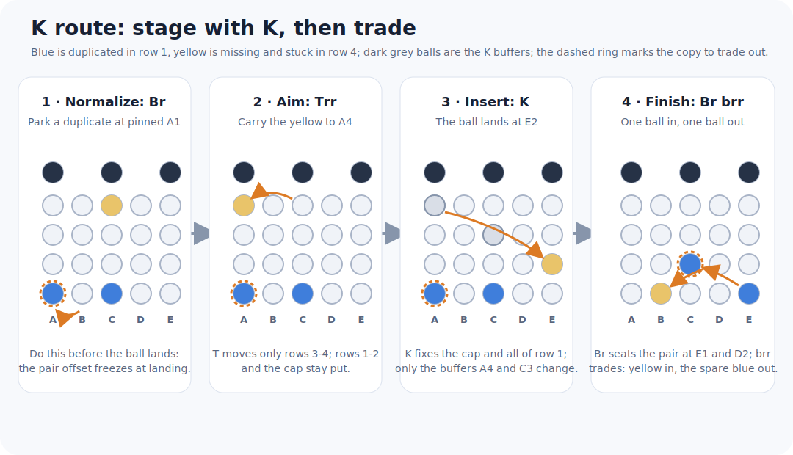

# A compact Star Tenbillion solution

The [Pedro Luis solution](three-algorithm-solution.md) uses three reusable
algorithms. A method attributed to
Naoaki Takashima showed that one three-cycle is enough. An exhaustive GAP
search finds a shorter three-cycle with a simple mirrored pattern.

This page first defines the algorithm and its insertion tool, then walks the
row-by-row solve in three steps, and closes with the group-theoretic and
historical background.



## One algorithm

Moves and positions follow the [project notation](notation.md); recall that
`T` is the top disc with the core up, `b` is the bottom disc with the core
pushed down, and a doubled suffix such as `ll` or `rr` means two consecutive
clicks.

In this notation, use

```text
C = Tl bll Tl | br Trr br
```

The bar separates two mirrored halves. Remember it as:

```text
top-bottom-top,    left  1-2-1
bottom-top-bottom, right 1-2-1
```



Only the normal-core top disc (`T`) and lowered-core bottom disc (`b`) occur.
GAP calculates

```text
C = T b^2 T b^-1 T^-2 b^-1 = (11,13,18).
```

The result moves exactly three balls and fixes the other 20. Applying `C`
twice reverses the cycle, so no inverse algorithm needs to be memorized.

Run the exact check with:

```sh
pixi run compact
pixi run search-compact
pixi run test
```

### Compactness result

The search treats any nonzero turn of one disc in one core position as one
face-turn-metric (FTM) move. Thus `l`, `ll`, `rr`, and `r` each cost one move.
It enumerates all reduced words over the 16 possible moves and finds no pure
3-cycle through depth 5; `C` is the first result at depth 6. Consequently six
FTM moves is optimal for a pure 3-cycle in this generator set.

In the fifth-turn metric, `C` costs eight clicks because each double turn costs
two. A second exhaustive pass finds no pure 3-cycle through depth 7, so eight
clicks is optimal too. This local result does not imply that using a shortest
3-cycle minimizes an entire solve.

## Turn `C` into an insertion tool

The numbered cycle `(11,13,18)` is

```text
C = (C3 E3 E2).
```

For column building, use its conjugate

```text
K = tr C tl
  = tr (Tl bll Tl br Trr br) tl
  = (A4 E2 C3).
```

The initial `tr` and final `tl` are setup and undo moves, not a second
algorithm to memorize. One application of `K` moves the contents as follows:

| From | To |
|---|---|
| `A4` | `E2` |
| `E2` | `C3` |
| `C3` | `A4` |

`K` therefore inserts a ball from `A4` into `E2`. Applying `K` twice inserts
a ball from `C3` into `E2`. All other positions are fixed.


In general, if setup turns `S` carry a destination and donor to these working
positions, perform `S K S^-1` or `S K^2 S^-1`. Since words are executed from
left to right, undo the last setup turn first and reverse every direction.

## Step 1: cap and row 1

The column/row names and the solved-state convention are defined in the
[project notation](notation.md); in particular the bottom row chooses each
column's target color.

First put the three odd-color balls in the cap and arrange row 1 to contain one
ball of each remaining color. This is the preliminary, intuitive part of the
Takashima method. Merely rotating the lower disc cannot change which colors
are in row 1; use ordinary disc/core moves until the five colors are present,
then choose their circular order. From this point onward, the cycles below
leave the cap and row 1 fixed after every setup is undone.

Do the cap before row 1. The generators interfere in one direction only: the
cap exchanges balls only through `t`, which mixes the cap with row 4, while
`T`, `B`, and `b` all fix the cap; conversely, row 1 exchanges balls only
through `b`, which never reaches the cap. Filling the cap may haul odd-color
balls up from the bottom rows and churn row 1 along the way, but the later
row-1 work with `b`, `B`, and `T` cannot disturb a finished cap. If a color
needed in row 1 is stranded in row 4, bring it down with a paired setup such
as `tr ... tl` so the cap returns intact. This ordering is a convenience, not
a prerequisite: cap balls are indistinguishable, so take any shortcut the
scramble offers.

### Step 1a: filling the cap

Each `t` click trades cap balls with row 4 at fixed slots:

| Move | Inserts into cap | Ejects from cap |
|---|---|---|
| `tl` | `B4` to `C5` and `E4` to `A5` | `A5` to `B4` and `E5` to `E4` |
| `tll` | `B4` to `E5` only | `C5` to `E4` only |
| `trr` | `E4` to `C5` only | `E5` to `B4` only |

`tll` is the cap's single-ball insertion tool: it swaps exactly one ball in
from `B4` and one out from `C5`, while the other two cap balls only cycle
among themselves. The seats `B4`, `E4`, `C5`, and `E5` in the table are
fixed by the `t` cycles and are never a choice; the only free choice is
which odd-color ball to stage next. This gives a uniform recipe:

1. Stage an odd-color ball into row 4, lifting it with `b` clicks and a `t`
   click as needed; nothing is final yet, so free churn is fine.
2. Rotate the top disc with `T`, which never touches the cap, until that ball
   sits at `B4`.
3. Insert with `tll`. The ejected ball lands at `E4`; rotate it out of the
   way during the next aim.
4. Repeat three times. Each `tll` also cycles `A5` to `C5`, so the remaining
   wrong ball always reaches the `C5` ejection seat in time, and three
   insertions fill the cap exactly.


When two odd-color balls are already in row 4, rotate them to `B4` and `E4`
and a single `tl` inserts both at once; finish with the third ball at `E4`
and `trr`. Ordering within the cap never matters because the three balls are
identical.

### Step 1b: arranging row 1

Row 1 mirrors the cap one level down. Every `b` click fixes `A1`, `C1`, and
`D1`, so row 1 trades balls only at the two seats `B1` and `E1`:

| Move | Inserts into row 1 | Ejects from row 1 |
|---|---|---|
| `bl` | `A2` to `B1` and `D2` to `E1` | `B1` to `C2` and `E1` to `A2` |
| `bll` | `C2` to `E1` only | `B1` to `D2` only |
| `brr` | `D2` to `B1` only | `E1` to `C2` only |


One `bll` trade swaps the ball at `B1` out of row 1 and the ball at `C2`
into row 1. `B` turns rows 1 and 2 together, so the spacing between a row-2
ball and a row-1 ball can never change once both are in place. Every case
below therefore first creates the right spacing -- a duplicate parked on a
pinned seat, the missing ball landing beside it -- and only then rotates the
pair into the working seats.

How to read the position letters in the cases below: almost every named
position is a fixed working seat of a move, never a free choice. `B1` and
`E1` with their row-2 partners `A2`, `C2`, `D2` are forced by the `b` cycles
in the table; `A3` and `D3` are the only seats `bl` drops from; `A4`, `E2`,
and `C3` are forced by `K`. The only free choices in a round are which
duplicated ball to evict, which ball of the missing color to fetch, and --
where a mirrored route exists -- which side to take. Each case fixes one
side for definiteness; the mirror (swap `A1 A3 B2 bll` for `D1 D3 E2 brr`)
works symmetrically.

Repeat the following round while a color appears twice in row 1: spot a
duplicated color in row 1 and a missing color in rows 2-4, then pick a
route. Where the ball sits does not dictate the route -- most locations
have a cheap option and a churn-free option:

| Missing ball at | Cheapest route | Churn-free route |
|---|---|---|
| row 2, one column from a duplicate | direct | direct |
| row 2, elsewhere | `bl` lift, then drop | `K` lift from `E2`, then K |
| row 3 | drop | K, staged with `K K` |
| row 4 | K | K |

Each round places exactly one missing color, so one round never finishes
row 1 by itself; expect up to four rounds.

#### Drop route: stage with a `bl` drop

The shortest staging when the missing ball is in row 3, at the price of
churning two other row-1 seats.

1. Turn `B` until a duplicate sits at `A1`. That seat is pinned, so the
   duplicate survives the staging click.
2. Aim the missing ball to `A3` with `T`, which fixes rows 1-2 and the cap.
3. Drop with `bl`: the ball lands at `B2`, just right of the duplicate.
4. Turn `Bl`: the duplicate rides `A1` to `B1`, the ball `B2` to `C2`.
5. Apply `bll`: the missing color enters at `E1`, the duplicate leaves to
   `D2`.

Row 1 changes as follows. Write `d` for the duplicated color (`d*` the copy
being traded out), `m` for the missing color, `x y z` for the other three
row-1 balls, and `p s` for the row-2 balls that start at `A2` and `D2`:

```text
        A1  B1  C1  D1  E1
start   d*  x   d   y   z     m in row 3
Trr     d*  x   d   y   z     m to A3; row 1 untouched
bl      d*  p   d   y   s     m to B2; x out to C2, z out to A2
Bl      s   d*  p   d   y     m to C2; rows 1-2 rotate together
bll     s   y   p   d   m     m in at E1; d* out to D2
```

After the round, `x` sits at `A2` and `z` at `D3`, ready for later rounds.

For example, with blue at `A1` and `C1`, no yellow in row 1, and a yellow
ball at `C3`, the duplicate is already parked: `Trr` aims the yellow to
`A3`, `bl` drops it to `B2`, `Bl` carries the blue to `B1` and the yellow to
`C2`, and `bll` finishes with yellow at `E1` and the spare blue parked at
`D2`.



#### Direct route: rotate and trade

No staging at all: usable when the missing ball already sits in row 2 one
column from a duplicate.

- Just right of a duplicate (duplicate at `X1`, ball at `(X+1)2`)? Turn `B`
  until the pair reaches `B1` and `C2`, then `bll`.
- Just left of a duplicate? Turn `B` until the pair reaches `E1` and `D2`,
  then `brr`.
- Any other offset: restage per the table -- lift with `bl` (`B2` to `C3`,
  `E2` to `A3`) for the drop route, or carry the ball to `E2` and apply `K`
  once (`E2` to `C3`) for the K route.

Row 1 changes as follows on the just-right route (duplicate `d*` at `D1`,
missing `m` at `E2`); the just-left route mirrors it. There is no `bl` drop,
so no unknown ball enters row 1 -- every seat stays known:

```text
        A1  B1  C1  D1  E1
start   x   y   z   d*  w     m at E2
Brr     z   d*  w   x   y     m to C2; rows 1-2 rotate together
bll     z   y   w   x   m     m in at E1; d* out to D2
```



#### K route: stage with the insertion tool

The churn-free staging: `K` and `K K` fix the cap and all of rows 1-2
outside `E2`, so nothing is disturbed while the ball travels. It reaches
every location -- a row-4 ball directly, a row-3 ball with `K K`, and a
row-2 ball after a one-`K` lift from `E2` -- at the cost of more clicks.
Prefer it once row 1 is nearly complete and every seat holds a needed ball.

1. Turn `B` until a duplicate sits at `A1` -- before anything lands, because
   the spacing freezes at landing.
2. Aim the ball with `T`: to `A4` if it is in row 4, or to `C3` if it is in
   row 3.
3. Apply `K` (from `A4`) or `K K` (from `C3`): the ball lands at `E2` while
   the cap and all of row 1 stay fixed.
4. Turn `Br`: the duplicate rides `A1` to `E1`, the ball `E2` to `D2`.
5. Apply `brr`.

Row 1 changes as follows (shown for a row-4 ball); `K` never touches it, so
as in the direct route every seat stays known:

```text
        A1  B1  C1  D1  E1
start   d*  x   d   y   z     m in row 4, then aimed to A4
K       d*  x   d   y   z     m to E2; row 1 untouched
Br      x   d   y   z   d*    m to D2; rows 1-2 rotate together
brr     x   m   y   z   d     m in at B1; d* out to C2
```

Here `A1` pairs with `brr` -- not the usual `bll` -- because `K` always
lands the ball at `E2`, one seat left of `A1`. The mirror parks the
duplicate at `D1` instead and finishes with `Brr` and `bll`. A raw `t` click
also drops `A4` to `B3`, but it trades one cap ball and costs an extra `tll`
round to repay.



#### About the churn

Every `b` click trades the seats `B1` and `E1` with `A2` and `D2`. The
duplicate parked at `A1` is safe, but in the drop route the `bl` drop also
swaps whatever sits at `B1` and `E1` with two row-2 balls. Tracing the whole
round: the ball swept from `B1` finishes at `A2`, the ball swept from `E1`
is lifted to `D3`, and the two row-2 balls that replaced them end at `A1`
and `C1`. So one round can leave row 1 looking worse -- two wanted colors
out, two unknown balls in -- and that is still fine: the displaced balls sit
in row 2 and row 3, exactly where later rounds pick them up, and every round
deterministically inserts one missing color and ejects one duplicate. Only
the set of five colors matters, because row 1 defines the targets.

This also settles how many rounds row 1 needs. A churn-free round (direct
or K route) raises the number of distinct row-1 colors by exactly one, so
at most four such rounds arrange row 1 from any scramble. Drop-route rounds
are cheaper per round, but their churn can displace wanted colors and add
rounds.

## Step 2: align row 2, one column at a time

Everything from here to the end of the solve is one shape of operation, the
conjugated insertion `S K S^-1` or `S K K S^-1`: setup turns `S` carry a
destination and a donor to the fixed working seats, `K` fires, and the
setup unwinds in reverse order. As in Step 1b, the seats are forced by `K`
and never a choice -- `E2` receives, `A4` donates under one `K`, `C3`
donates under `K K`. The free choices are which column to fill next and
which donor ball to fetch.

To fill a wrong position `X2`, where `X` is any column:

1. Read the required color from the anchor directly below it at `X1`.
2. Rotate the lower disc until the destination `X2` reaches `E2`. Record
   this lower setup turn.
3. Rotate the upper disc to carry a donor of the required color to its
   seat: a row-4 donor to `A4`, or a row-3 donor to `C3`. Record this upper
   setup turn.
4. Apply `K` once for a donor at `A4`, or twice for a donor at `C3`.
5. Undo the upper setup, then undo the lower setup. The required ball is now
   at the original destination `X2`; previously completed row-2 positions
   have not moved.

### No donor above row 2

If every available ball of the required color is already in row 2, first use
the cycle as a lift: carry one of those balls to `E2`, apply `K` once to move
it to `C3`, and undo the lower setup. Rows 3 and 4 are still unsolved, so
their two affected positions are safe buffers. The lifted ball is now a
row-3 donor for the normal insertion above.

### Worked insertion

Suppose `B1` is blue, `B2` is wrong, and a blue ball is at `D4`.

- `Brr` carries the destination `B2` to `E2`.
- `Tll` carries the blue ball from `D4` to `A4`.
- `K` carries that blue ball from `A4` to `E2`.
- Undo with `Trr Bll`.

The complete operation is

```text
Brr Tll K Trr Bll
```

and finishes at the original orientation with blue at `B2`. Only the two
unsolved buffer balls that shared the 3-cycle moved elsewhere.


Repeat this insertion for `A2` through `E2`. It is usually efficient to leave
already-correct positions alone and choose donors from columns that are still
wrong.

## Step 3: complete rows 3 and 4 column-by-column

Once row 2 matches row 1, use one row-2 position as temporary storage: the
buffer. It may be wrong during this phase; the other completed row-2
positions stay fixed. The phase alternates two operations -- load the
buffer, place the buffered ball -- and chains them until the upper rows are
done.

### Load the buffer

Take the next required upper-row ball down into the buffer: rotate it to
`A4` and apply `K`, or rotate it to `C3` and apply `K` twice. Conjugate
with lower-disc turns when the buffer is not at `E2`.

### Place the buffered ball

- Row-4 destination: rotate it to `A4`, carry the buffer to `E2`, apply `K`
  twice, and undo both rotations. The three seats cycle: the required ball
  lands on the destination, the wrong ball from the destination moves to
  `C3`, and the buffer receives the old `C3` ball.
- Row-3 destination: rotate it to `C3`, carry the buffer to `E2`, apply `K`
  once, and undo both rotations. Here the wrong ball moves to `A4` and the
  buffer receives the old `A4` ball.

### Follow the chain

Look at the color now in the buffer and place it, with the same operation,
in the row-3 or row-4 slot above the matching row-1 anchor. Continue
following displaced colors. This is exactly following a cycle of a
permutation: eventually the chain closes and a correct color returns to the
buffer. Start another chain if any upper position is still in the wrong
column.

### Parity ending

When only two colors appear wrong, do not try to swap just two balls: every
legal move is even. Include the row-2 buffer as the third position and use `K`
or `K` twice. Because balls of a color are indistinguishable, the final
same-color exchange absorbs the parity restriction.

At the end, every position above `A1` has color `A1`, every position above
`B1` has color `B1`, and so forth. Rotate both discs together only if you want
a particular color displayed at the front.

The setup choices depend on the scramble, so this is a repeatable insertion
method rather than one fixed solution string. Its advantage is that every
placement reduces to the same directed 3-cycle.

## GAP group-theoretic check

GAP also gives

```text
NormalClosure(A23, <C>) = A23.
```

Thus conjugates of this one 3-cycle generate the entire orientation-preserving
move group. This is the algebraic reason a single local cycle is sufficient as
the reusable operation. It does not mean that arbitrary conjugating setup
words are automatically short.

### The stabilizer picture

The move group is all of `A23`, which is highly transitive, so the pointwise
stabilizer of any `k` positions is the full alternating group on the other
`23 - k`: fixing any four row-1 seats leaves `A19`, fixing row 1 leaves
`A18`, and fixing the cap and row 1 leaves `A15` on rows 2-4. Which seats
are fixed never matters to the subgroup, only how many.

What distinguishes seats is which single clicks lie inside each stabilizer:

| Positions fixed pointwise | Clicks inside the stabilizer |
|---|---|
| row 1 | `T`, `t` |
| cap | `T`, `B`, `b` |
| cap and row 1 | `T` only |
| `A1`, `C1`, `D1` | `T`, `t`, `b` |

Staying inside a stabilizer at every click reaches far less than the
stabilizer itself:

- `<T, t>` is the full pointwise stabilizer of rows 1-2, the alternating
  group on the upper 13 positions. The top half needs no conjugation tricks.
- `<T, b>` fixes the cap and `A1 C1 D1`, but has order 63000 against the
  stabilizer's `17!/2 = 177843714048000`. The algorithm `C` is a word in
  `T` and `b`, so it lives inside this tiny subgroup.
- `<T, t, b>` has order about `3.3 x 10^12` against `Stab(A1 C1 D1) =
  20!/2`, about `1.2 x 10^18`.

Most of each stabilizer is therefore reachable only by leaving it
transiently and returning: the setup-and-undo conjugations of the method are
structurally necessary, not a convenience. The closing check: the 25
conjugates `S K S^-1` with `S` ranging over `<T, B>` generate the entire
pointwise stabilizer of cap and row 1. This is the exact algebraic guarantee
that Steps 2 and 3 can finish every position with the one insertion tool.
Reproduce these computations with:

```sh
pixi run stabilizers
```

## Historical construction

Takashima's historical one-algorithm idea translates to

```text
(tl Tr bl Br Tl Bl tr br), repeated twice.
```

One pass is `(4,9,18)(7,12)(11,15)`: a 3-cycle and two swaps. Repeating it
cancels the swaps and leaves `(4,18,9)`. This costs 16 fifth-turn clicks, twice
the new word, but it motivates the same row-by-row method. The historical
description appears in the 1981 Cube Lovers archive; its orientation
conventions differ from this project.

The other documented macros cost 14, 14, and 44 fifth-turns and sometimes move
five or nine useful balls at once. Which method produces a shorter full solve
depends on the scramble.

The separate [optimal-number study](optimal-number.md) concerns provably
shortest solutions and currently establishes lower bounds, not a matching
God's number.

## Source

- [Stan Isaacs, “Ten Billion Puzzle (the Barrel),” Cube Lovers archive
  (1981)](https://www.math.rwth-aachen.de/~Martin.Schoenert/Cube-Lovers/Stan_Isaacs__Ten_Billion_Puzzle_%28the_Barrel%29.html)
