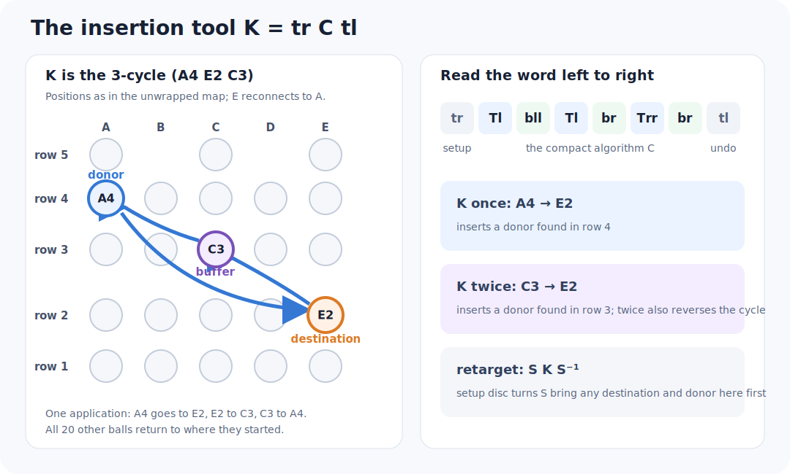
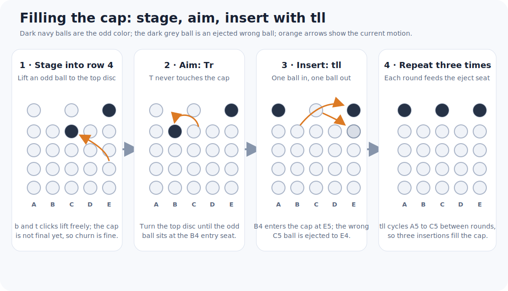
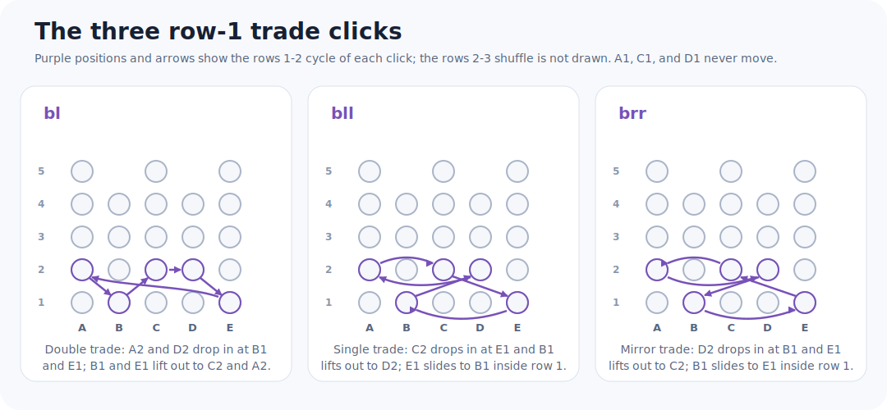
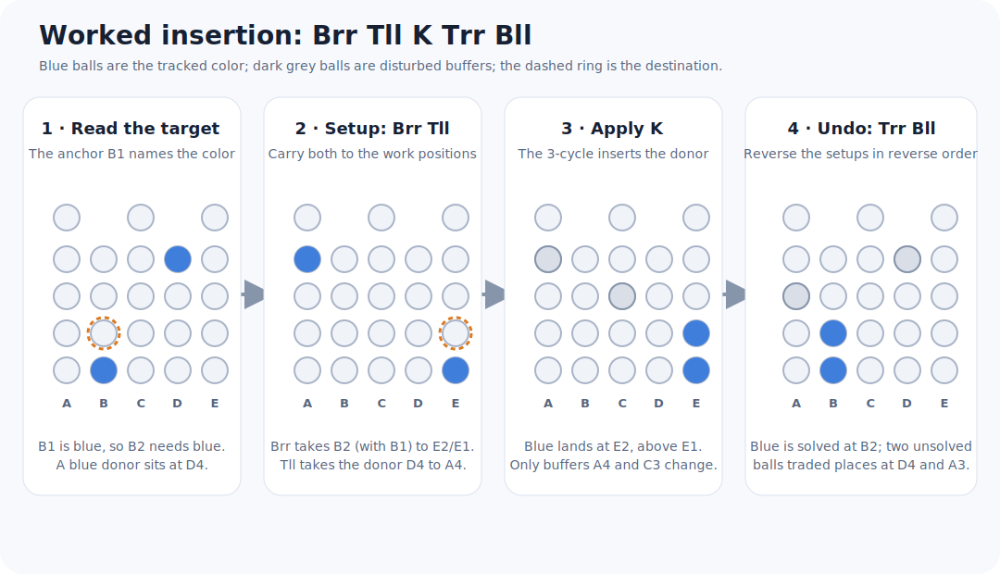

# A compact Star Tenbillion solution

The [Pedro Luis solution](three-algorithm-solution.md) uses three reusable
algorithms. A method attributed to
Naoaki Takashima showed that one three-cycle is enough. An exhaustive GAP
search finds a shorter three-cycle with a simple mirrored pattern.

This page first defines the algorithm and its insertion tool, then walks the
row-by-row solve in three steps, and closes with the group-theoretic and
historical background.


## One algorithm

Moves and positions follow the [project notation](notation.md); recall that
`T` is the top disc with the core up, `b` is the bottom disc with the core
pushed down, and a doubled suffix such as `ll` or `rr` means two consecutive
clicks.

In this notation, use

```text
C = Tl bll Tl | br Trr br
```

The bar separates two mirrored halves. Remember it as:

```text
top-bottom-top,    left  1-2-1
bottom-top-bottom, right 1-2-1
```


Only the normal-core top disc (`T`) and lowered-core bottom disc (`b`) occur.
GAP calculates

```text
C = T b^2 T b^-1 T^-2 b^-1 = (11,13,18).
```

The result moves exactly three balls and fixes the other 20. Applying `C`
twice reverses the cycle, so no inverse algorithm needs to be memorized.

Run the exact check with:

```sh
pixi run compact
pixi run search-compact
pixi run test
```

### Compactness result

The search treats any nonzero turn of one disc in one core position as one
face-turn-metric (FTM) move. Thus `l`, `ll`, `rr`, and `r` each cost one move.
It enumerates all reduced words over the 16 possible moves and finds no pure
3-cycle through depth 5; `C` is the first result at depth 6. Consequently six
FTM moves is optimal for a pure 3-cycle in this generator set.

In the fifth-turn metric, `C` costs eight clicks because each double turn costs
two. A second exhaustive pass finds no pure 3-cycle through depth 7, so eight
clicks is optimal too. This local result does not imply that using a shortest
3-cycle minimizes an entire solve.

## Turn `C` into an insertion tool

The numbered cycle `(11,13,18)` is

```text
C = (C3 E3 E2).
```

For column building, use its conjugate

```text
K = tr C tl
  = tr (Tl bll Tl br Trr br) tl
  = (A4 E2 C3).
```

The initial `tr` and final `tl` are setup and undo moves, not a second
algorithm to memorize. One application of `K` moves the contents as follows:

| From | To |
|---|---|
| `A4` | `E2` |
| `E2` | `C3` |
| `C3` | `A4` |

`K` therefore inserts a ball from `A4` into `E2`. Applying `K` twice inserts
a ball from `C3` into `E2`. All other positions are fixed.



In general, if setup turns `S` carry a destination and donor to these working
positions, perform `S K S^-1` or `S K^2 S^-1`. Since words are executed from
left to right, undo the last setup turn first and reverse every direction.

## Step 1: cap and row 1

The column/row names and the solved-state convention are defined in the
[project notation](notation.md); in particular the bottom row chooses each
column's target color.

First put the three odd-color balls in the cap and arrange row 1 to contain one
ball of each remaining color. This is the preliminary, intuitive part of the
Takashima method. Merely rotating the lower disc cannot change which colors
are in row 1; use ordinary disc/core moves until the five colors are present,
then choose their circular order. From this point onward, the cycles below
leave the cap and row 1 fixed after every setup is undone.

Do the cap before row 1. The generators interfere in one direction only: the
cap exchanges balls only through `t`, which mixes the cap with row 4, while
`T`, `B`, and `b` all fix the cap; conversely, row 1 exchanges balls only
through `b`, which never reaches the cap. Filling the cap may haul odd-color
balls up from the bottom rows and churn row 1 along the way, but the later
row-1 work with `b`, `B`, and `T` cannot disturb a finished cap. If a color
needed in row 1 is stranded in row 4, bring it down with a paired setup such
as `tr ... tl` so the cap returns intact. This ordering is a convenience, not
a prerequisite: cap balls are indistinguishable, so take any shortcut the
scramble offers.

### Step 1a: filling the cap

Each `t` click trades cap balls with row 4 at fixed slots:

| Move | Inserts into cap | Ejects from cap |
|---|---|---|
| `tl` | `B4` to `C5` and `E4` to `A5` | `A5` to `B4` and `E5` to `E4` |
| `tll` | `B4` to `E5` only | `C5` to `E4` only |
| `trr` | `E4` to `C5` only | `E5` to `B4` only |

`tll` is the cap's single-ball insertion tool: it swaps exactly one ball in
from `B4` and one out from `C5`, while the other two cap balls only cycle
among themselves. This gives a uniform recipe:

1. Stage an odd-color ball into row 4, lifting it with `b` clicks and a `t`
   click as needed; nothing is final yet, so free churn is fine.
2. Rotate the top disc with `T`, which never touches the cap, until that ball
   sits at `B4`.
3. Insert with `tll`. The ejected ball lands at `E4`; rotate it out of the
   way during the next aim.
4. Repeat three times. Each `tll` also cycles `A5` to `C5`, so the remaining
   wrong ball always reaches the `C5` ejection seat in time, and three
   insertions fill the cap exactly.



When two odd-color balls are already in row 4, rotate them to `B4` and `E4`
and a single `tl` inserts both at once; finish with the third ball at `E4`
and `trr`. Ordering within the cap never matters because the three balls are
identical.

### Step 1b: arranging row 1

Row 1 mirrors the cap one level down. Every `b` click fixes `A1`, `C1`, and
`D1`, so row 1 trades balls only at the two seats `B1` and `E1`:

| Move | Inserts into row 1 | Ejects from row 1 |
|---|---|---|
| `bl` | `A2` to `B1` and `D2` to `E1` | `B1` to `C2` and `E1` to `A2` |
| `bll` | `C2` to `E1` only | `B1` to `D2` only |
| `brr` | `D2` to `B1` only | `E1` to `C2` only |



While a color appears twice in row 1, trade one copy for a missing color
with `bll`:

1. Spot a duplicated color in row 1 and a missing color in rows 2-4.
2. Stage a ball of the missing color: aim it inside row 3 with `T`, which
   fixes rows 1-2 and the cap, then drop it with `bl` (`A3` to `B2` or `D3`
   to `E2`) into the column just right of a duplicate.
3. Turn `B`. It moves rows 1 and 2 rigidly, so the staged offset cannot
   change; stop when the duplicate reaches `B1` and the staged ball `C2`.
   The mirrored `brr` works from the seats `E1` and `D2` instead when the
   drop lands just left of a duplicate.
4. Apply `bll`: the missing color enters at `E1` and the duplicate leaves to
   `D2`. Staging churn at the `B1` and `E1` seats is harmless; only the set
   of five colors matters, because row 1 defines the targets.

When row 3 has no ball of the missing color, stage from wherever it is:

- From row 2 at the wrong offset: rotate `B` to carry the ball to `B2` or
  `E2`, lift it into row 3 with `bl` (`B2` to `C3` or `E2` to `A3`), and
  continue from item 2 of the recipe.
- From row 4: use the insertion tool `K = (A4 E2 C3)` defined above, which
  carries `A4` straight to `E2` while fixing the cap and all of row 1.
  First turn `B` so a duplicate sits at the pinned seat `A1`; the offset is
  frozen once the ball lands, so this turn must come before `K`. Then aim
  the ball to `A4` with `T`, apply `K`, and finish with `Br` (duplicate to
  `E1`, ball to `D2`) and `brr`. A raw `t` click also drops `A4` to `B3`,
  but it trades one cap ball and costs an extra `tll` round to repay.

For example, with blue at `A1` and `C1`, no yellow in row 1, and a yellow
ball at `C3`: `Trr` aims the yellow to `A3`, `bl` drops it to `B2`, `Bl`
carries the blue to `B1` and the yellow to `C2`, and `bll` finishes with
yellow at `E1` and the spare blue parked at `D2`.


## Step 2: align row 2, one column at a time

To fill a wrong position `X2`, where `X` is any column:

1. Read the required color from the anchor directly below it at `X1`.
2. Rotate the lower disc so that the destination `X2` is carried to the work
   position `E2`. Record this lower setup turn.
3. Find a ball of the required color in row 4 or row 3. Rotate the upper disc
   to carry a row-4 ball to `A4`, or a row-3 ball to `C3`. Record this upper
   setup turn.
4. Use `K` once for a ball at `A4`, or twice for a ball at `C3`.
5. Undo the upper setup, then undo the lower setup. The required ball is now at
   the original destination `X2`; previously completed row-2 positions have
   not moved.

If every available ball of the required color is already in row 2, first use
the cycle as a lift: carry one of those balls to `E2`, apply `K` once to move it
to `C3`, and undo the lower setup. Rows 3 and 4 are still unsolved, so their two
affected positions are safe buffers.

### Worked insertion

Suppose `B1` is blue, `B2` is wrong, and a blue ball is at `D4`.

- `Brr` carries the destination `B2` to `E2`.
- `Tll` carries the blue ball from `D4` to `A4`.
- `K` carries that blue ball from `A4` to `E2`.
- Undo with `Trr Bll`.

The complete operation is

```text
Brr Tll K Trr Bll
```

and finishes at the original orientation with blue at `B2`. Only the two
unsolved buffer balls that shared the 3-cycle moved elsewhere.



Repeat this insertion for `A2` through `E2`. It is usually efficient to leave
already-correct positions alone and choose donors from columns that are still
wrong.

## Step 3: complete rows 3 and 4 column-by-column

Once row 2 matches row 1, use one row-2 position as temporary storage. It may
be wrong during this phase; the other completed row-2 positions stay fixed.

1. Load the next required upper-row ball into the chosen row-2 buffer. To move
   a ball down, rotate it to `A4` and apply `K`, or rotate it to `C3` and apply
   `K` twice. Conjugate with lower-disc turns when the buffer is not `E2`.
2. To fill a row-4 destination, rotate that destination to `A4`, carry the
   buffered ball to `E2`, apply `K` twice, and undo both rotations. The buffer
   now contains the ball displaced from the other working position.
3. To fill a row-3 destination, rotate it to `C3`, carry the buffered ball to
   `E2`, apply `K` once, and undo both rotations.
4. Look at the color now in the buffer and take it to the row-3 or row-4 slot
   above the matching row-1 anchor. Continue following displaced colors. This
   is exactly following a cycle in a permutation: eventually the chain closes
   and the correct color returns to the row-2 buffer.
5. Start another chain if any upper position is still in the wrong column.

When only two colors appear wrong, do not try to swap just two balls: every
legal move is even. Include the row-2 buffer as the third position and use `K`
or `K` twice. Because balls of a color are indistinguishable, the final
same-color exchange absorbs the parity restriction.

At the end, every position above `A1` has color `A1`, every position above
`B1` has color `B1`, and so forth. Rotate both discs together only if you want
a particular color displayed at the front.

The setup choices depend on the scramble, so this is a repeatable insertion
method rather than one fixed solution string. Its advantage is that every
placement reduces to the same directed 3-cycle.

## GAP group-theoretic check

GAP also gives

```text
NormalClosure(A23, <C>) = A23.
```

Thus conjugates of this one 3-cycle generate the entire orientation-preserving
move group. This is the algebraic reason a single local cycle is sufficient as
the reusable operation. It does not mean that arbitrary conjugating setup
words are automatically short.

## Historical construction

Takashima's historical one-algorithm idea translates to

```text
(tl Tr bl Br Tl Bl tr br), repeated twice.
```

One pass is `(4,9,18)(7,12)(11,15)`: a 3-cycle and two swaps. Repeating it
cancels the swaps and leaves `(4,18,9)`. This costs 16 fifth-turn clicks, twice
the new word, but it motivates the same row-by-row method. The historical
description appears in the 1981 Cube Lovers archive; its orientation
conventions differ from this project.

The other documented macros cost 14, 14, and 44 fifth-turns and sometimes move
five or nine useful balls at once. Which method produces a shorter full solve
depends on the scramble.

The separate [optimal-number study](optimal-number.md) concerns provably
shortest solutions and currently establishes lower bounds, not a matching
God's number.

## Source

- [Stan Isaacs, “Ten Billion Puzzle (the Barrel),” Cube Lovers archive
  (1981)](https://www.math.rwth-aachen.de/~Martin.Schoenert/Cube-Lovers/Stan_Isaacs__Ten_Billion_Puzzle_%28the_Barrel%29.html)
