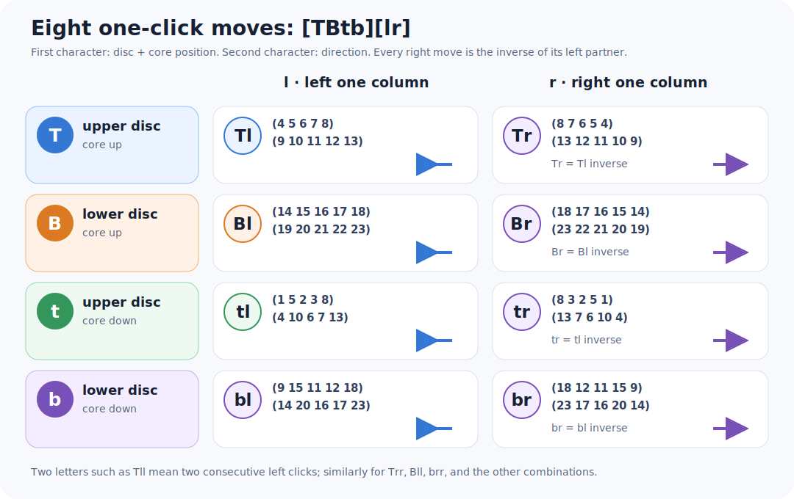
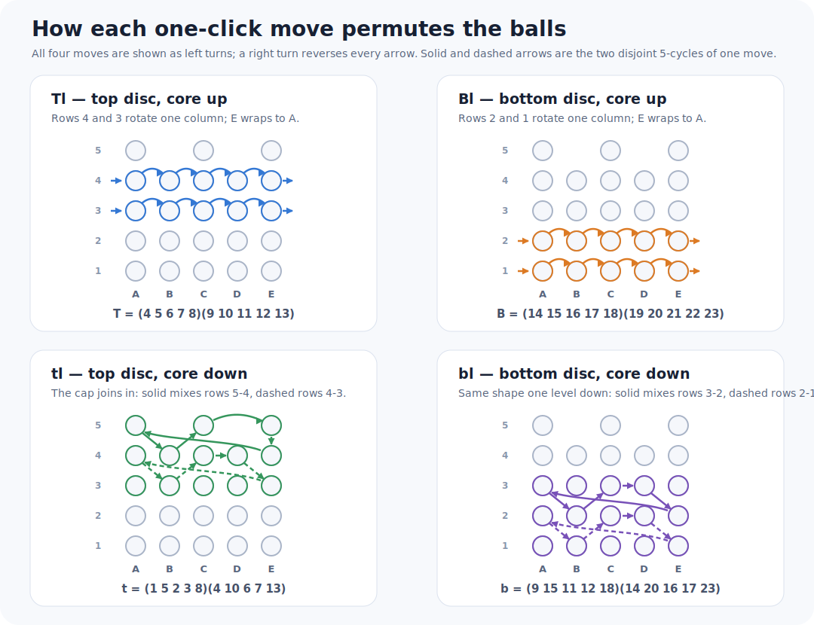

# Notation

Every document in this project uses the move and position names defined here.

## Moves

Hold the puzzle upright with its core in the normal (up) position. `T` and `B`
turn the upper and lower two-row discs one fifth-turn to the left. Lower-case
`t` and `b` are the corresponding turns with the core pushed down. A lower-case
`l` or `r` in a move word says left or right, so `tr` means one right turn of
the top disc with the core down. Two letters, such as `Tll`, mean two turns.

Moving the core between upper- and lower-case moves is implicit. Return it to
the normal position after a lower-case move sequence.



The next figure traces every ball through one click of each move. `T` and `B`
rotate their two rows rigidly, while the core-down moves `t` and `b` zigzag
between three rows; a right turn reverses every arrow. The numbered cycles
under each board use the position numbers of the next section.



## Positions

Hold the puzzle with the core up. Looking down from above, name the columns
`A B C D E` in the direction of a left disc turn; `C` is the front column.
Number rows from the bottom upward, so row 1 is the bottom and the three-ball
cap is row 5:

```text
          A     B     C     D     E
row 5    A5          C5          E5       three cap positions
row 4    A4    B4    C4    D4    E4
row 3    A3    B3    C3    D3    E3
row 2    A2    B2    C2    D2    E2
row 1    A1    B1    C1    D1    E1       bottom row
```

The GAP model and the search programs refer to the same 23 positions by the
numbers 1 through 23 shown in the unwrapped map below.


## Solved states

The solved cap contains the three balls of the color that occurs only three
times. Each other color occurs four times and fills rows 1-4 of one column.
The five column colors are interchangeable, so the bottom row can define the
answer. For example, if it reads

```text
A1=red  B1=blue  C1=green  D1=yellow  E1=orange,
```

then the target is red in `A2 A3 A4`, blue in `B2 B3 B4`, and so on. There is
no need to reproduce a factory color order.
