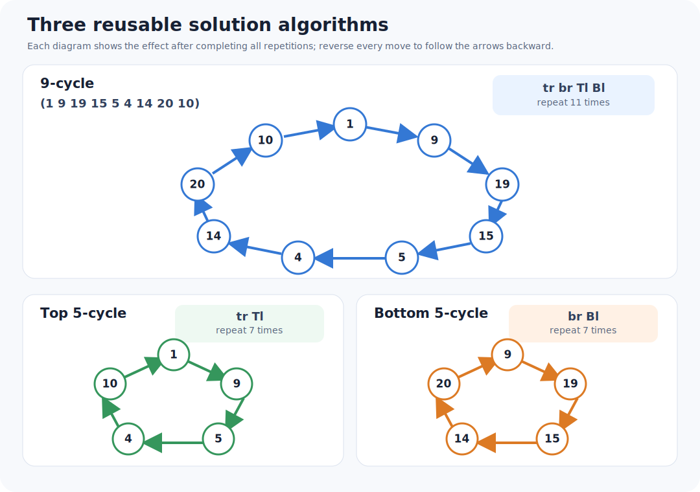
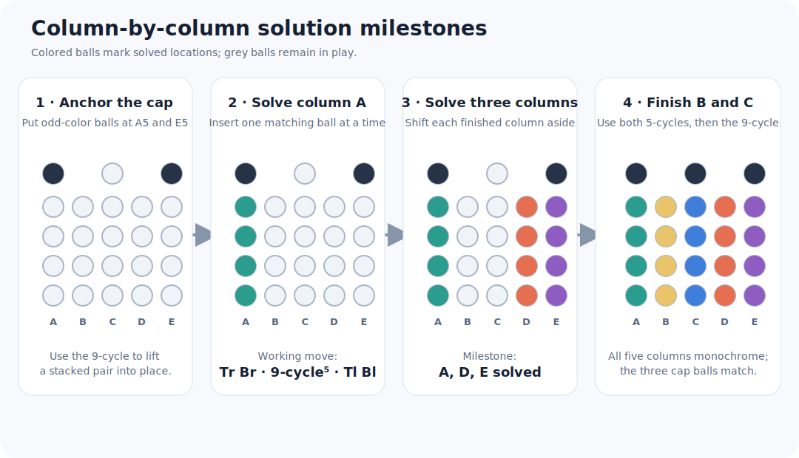

# The three-algorithm solution

Moves and positions follow the [project notation](notation.md). Three short
algorithms do almost all of the work:

| Name | Repeat this sequence | Effect |
|---|---|---|
| 9-cycle | `tr br Tl Bl` 11 times | Cycles the nine balls in two working columns by two places |
| top 5-cycle | `tr Tl` 7 times | Cycles the five balls in the upper part of the working columns by two places |
| bottom 5-cycle | `br Bl` 7 times | Cycles the five balls in the lower part of the working columns by two places |

Their inverses run the same cycles backwards. These give the following
systematic solve.

1. Put two odd-colored balls in one column, but not `A` or `E`. If necessary,
   use the 9-cycle to position one ball at `C1`, shift the pair with disc turns,
   and use `br Bl` to stack them. Turn both discs to move the pair to column
   `D`; repeat the 9-cycle until the two balls reach `A5` and `E5`.
2. Choose a four-ball color for column `A`. Repeat the 9-cycle until a ball of
   that color is at `B1`. Do `Tr Br`, run the 9-cycle five times, then do
   `Tl Bl`; this inserts the ball below any already solved balls in `A`.
   Repeat until all four balls fill column `A`.
3. Do `Tl Bl`, moving the solved column to `E`. Solve `A` again with a second
   color. Do `Tl Bl` once more, putting the solved columns at `D` and `E`, then
   solve `A` with a third color. Only `B` and `C` remain unsolved.
4. Choose the color for `B`. Use the top 5-cycle until a ball of that color is
   at `C3`, then use the bottom 5-cycle three times (or its inverse four times)
   to move it to `C2`. Repeat until all four balls of the color are in the
   bottom two rows. Use the top 5-cycle to put the remaining odd-colored ball
   at `B3`, then use the 9-cycle to finish both columns.

The algorithms and this column-by-column procedure are the solution published
by Pedro Luis and documented by Jaap Scherphuis. The GAP model checks the
stated 5- and 9-cycle supports directly; run `pixi run analyze`.

A single, shorter reusable algorithm is derived in the
[compact-solution study](compact-solution.md).
